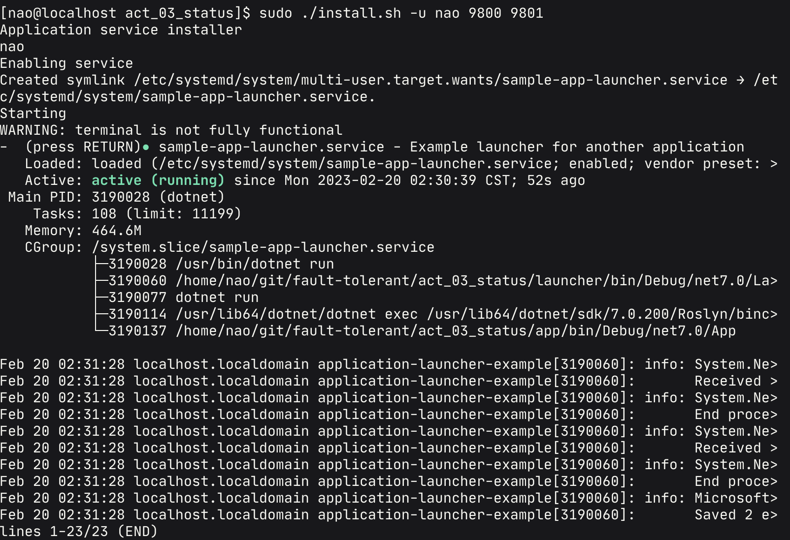
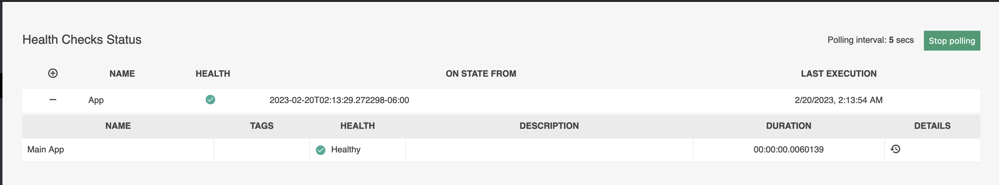
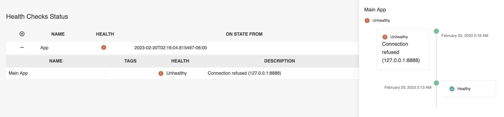
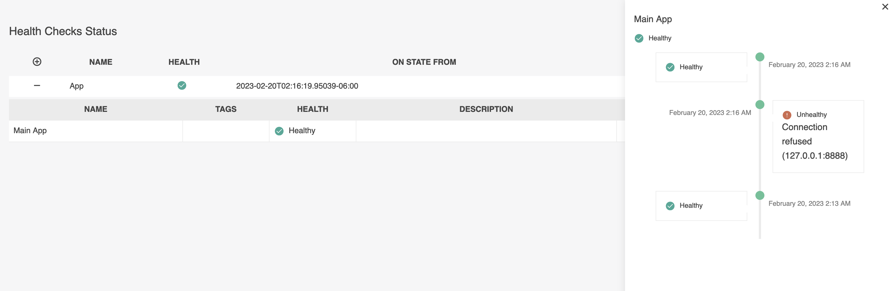
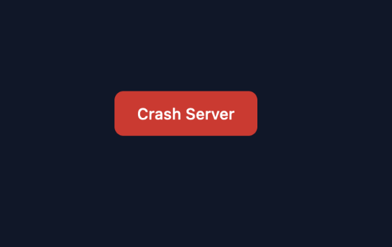

# Estatus

Alumno: De la Cruz Belmonte Christian Omar

Computación Tolerante a Fallas

---

En esta práctica se realizará una aplicación que sea capaz de ejecutarse como un servicio y verificar el estado actual de una aplicación.

---

## Demos

### [Link al supervisor](https://status.dev.cbnao.com/health)

### [Link a la "aplicación"](https://status-app.dev.cbnao.com/)

---

## Indice

- [Instalación del servicio](#instalación-del-servicio)

- [Supervisor de estatus](#supervisor-de-estatus)

- [Aplicación de ejemplo](#aplicación-de-ejemplo)

---

### Instalación del servicio

**[`^        Regresar al inicio        ^`](#estatus)**

Para realizar la instalación solo es necesario ejecutar el archivo `install.sh` de la siguiente forma

```bash
./install.shm [-u <USUARIO>] <PUERTO_SUPERVISOR> <PUERTO_APLICACION> 
```



### Supervisor de estatus

**[`^        Regresar al inicio        ^`](#estatus)**

Una vez ejecutado podremos visualizarlo en los puertos que hayamos designado al instalarlo como un servicio, podremos acceder al endpoint `/health` para visualizar el estatus de nuestra aplicación.



Si la aplicación tiene un error, este tomara aproximadamente 10 segundos para reiniciarla y en la pantalla de visualización se verá de la siguiente manera



Al ser reiniciada podrémos visualizar tambien que ya esta de vuelta en linea



Código para restaurar el programa

```csharp
void RunChildApp(ILogger logger) {
  var program = Process.Start(new ProcessStartInfo {
    WorkingDirectory = "../app",
    EnvironmentVariables = {
      ["PORT"] = appPort
    },
    Arguments = "run",
    FileName = "dotnet"
  });

  if (program is null) return;
  
  program.EnableRaisingEvents = true;
  program.Exited += async (sender, eventArgs) => {
    if (program.ExitCode == 0) {
      return;
    }
    logger.LogError("Child app closed. Restarting in 10 seconds");
    await Task.Delay(10000);
    logger.LogInformation("Child app restarting");

    program.Start();
  };
}
```

Código para agregar la visualización de estatus

```csharp
builder.Services.AddHttpClient();
builder.Services.AddHealthChecks()
  .AddCheck<AppHealthCheck>("Main App");
builder.Services.AddHealthChecksUI(options => {
    options.AddHealthCheckEndpoint("App",$"http://localhost:{port}/api/health");
    options.SetEvaluationTimeInSeconds(5);
  })
  .AddInMemoryStorage();

[...]

public async Task<HealthCheckResult> CheckHealthAsync(HealthCheckContext context, CancellationToken cancellationToken = new CancellationToken()) {
    var response = await _client.GetAsync($"http://127.0.0.1:{_appPort}", cancellationToken);

    if (!response.IsSuccessStatusCode) {
      return HealthCheckResult.Unhealthy();
    }
    
    return HealthCheckResult.Healthy();
  }
```

### Aplicación de ejemplo

**[`^        Regresar al inicio        ^`](#estatus)**

Para realizar la aplicación de ejemplo se optó por unicamente hacer una aplicación que permita finalizar su propio estado como si este fuera un error, por lo que la pagina solo mostrará un botón para poder `Crashear` el servidor y poder realizar la prueba de que se reinicie



Al dar click en el botón, la aplicación llamará a un endpoint que forzará su cierre y se recargará la pagina, de esta manera podremos notar que ya no puede cargar la página exitosamente.


