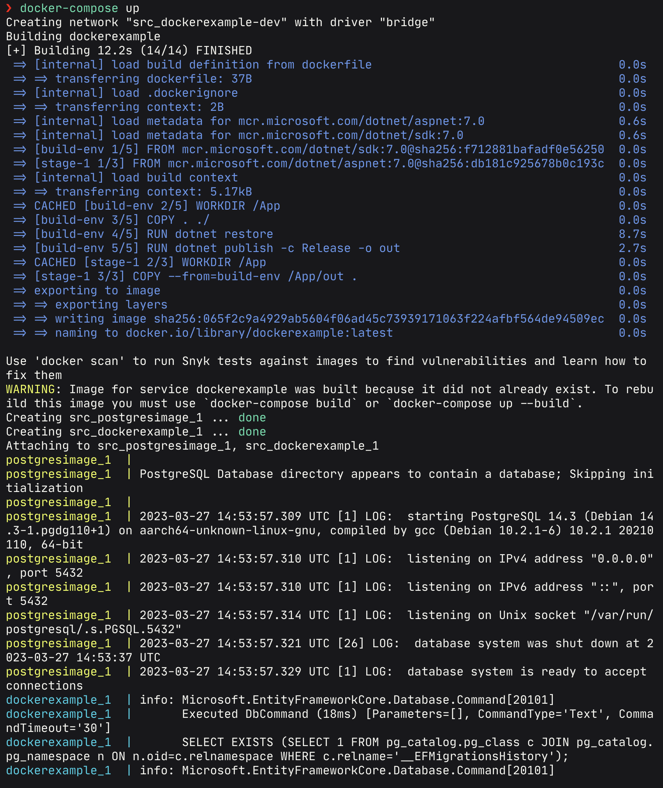
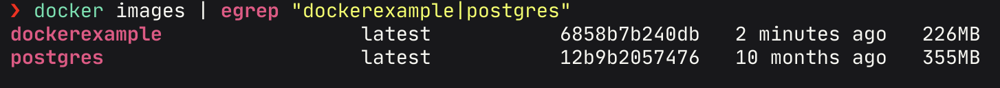
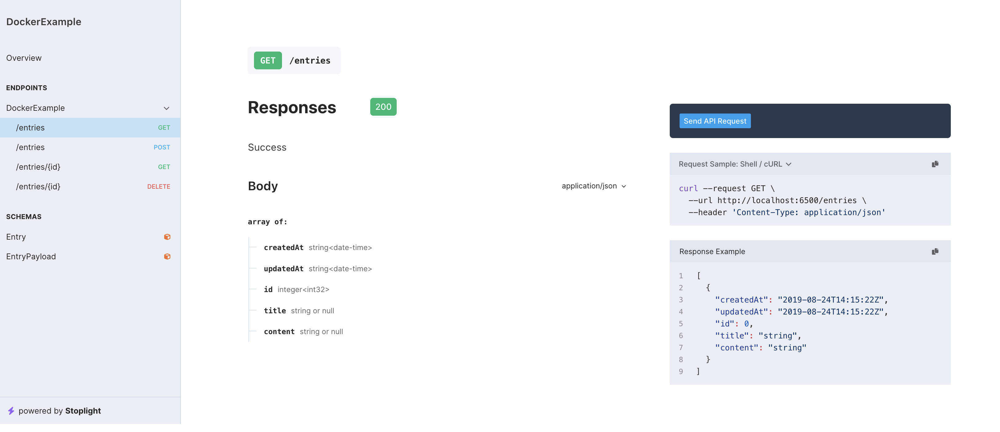

# Docker

Alumno: De la Cruz Belmonte Christian Omar

Computación Tolerante a Fallas

---

Para esta práctica se realizará un ejemplo de una aplicación montada en un contenedor de Docker. La aplicación tendrá una imagen de AspNet 7.0 junto con una imagen de PostgreSQL y serán ejecutadas por medio de un archivo docker-compose.yml

---

## Demos


---

## Indice

- [Dockerfile](#dockerfile)

- [Docker Compose](#docker-compose)

- [Ejecución](#ejecución)

---

### Dockerfile

**[`^        Regresar al inicio        ^`](#docker)**

Para comenzar con la práctica es necesario definir el entorno en el que será ejecutada nuestra aplicación. Debido a que la aplicación utilizada para este ejemplo está realizada en C# y ASP.NET 7, creamos un `dockerfile` con los siguientes contenidos:

```dockerfile
FROM mcr.microsoft.com/dotnet/sdk:7.0 AS build-env
WORKDIR /App

# Copy everything
COPY . ./
# Restore as distinct layers
RUN dotnet restore
# Build and publish a release
RUN dotnet publish -c Release -o out

# Build runtime image
FROM mcr.microsoft.com/dotnet/aspnet:7.0
WORKDIR /App
COPY --from=build-env /App/out .
ENTRYPOINT ["dotnet", "DockerExample.dll"]
```

### Dockerfile

**[`^        Regresar al inicio        ^`](#estatus)**

Lo siguiente que debemos hacer es generar un archivo `docker-compose.yml` en el cual colocaremos la información necesaria para la ejecución de nuestro contenedor, además, agregaremos la información del contenedor para la base de datos.

```yml
version: '1.0'

networks:
  dockerexample-dev:
    driver: bridge

services:
  dockerexample:
    image: dockerexample:latest
    depends_on:
      - "postgresimage"
    build:
      context: .
      dockerfile: ./dockerfile
    ports:
      - "6500:80/tcp"
    environment:
      PORT: "80"
      CONN_STRING_POSTGRES: "host=postgresimage;port=5432;database=wiki;username=wikiadmin;password=admin"
    networks:
      - dockerexample-dev

  postgresimage:
    image: postgres:latest
    ports:
      - "5432/tcp"
    restart: always
    volumes:
      - db_volume:/var/lib/postgresql/data
    environment:
      POSTGRES_USER: wikiadmin
      POSTGRES_PASSWORD: admin
      POSTGRES_DB: wiki
    networks:
      - dockerexample-dev

volumes:
  db_volume:
```

### Ejecución

**[`^        Regresar al inicio        ^`](#docker)**

Para ejecutar y generar los contenedores usamos el comando `docker-compose up` con el cual veremos lo siguiente.



Este comando se encargara de descargar las imagenes necesarias para correr lo que colocamos en nuestro archivo `docker-compose.yml` y ejecutará los contenedores.

Una vez dados de alta podremos ver nuestras imagenes con el comando `docker images`



Y la aplicación podrá ser visualizada en el puerto 6500, tal como definimos en el archivo `docker-compose.yml`.


